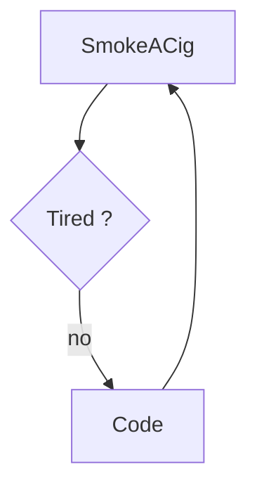

# 👋 Hi, I’m @VonFisch

## About Me
- 👀 I’m interested in video games, AI, and web development.
- 🌱 I’m currently learning full-stack development.
- 💞️ I’m looking to collaborate on software or web development projects and learn to work in a team. (A mentoring in a Swiss company woud be great!)
- 📫 How to reach me: [fischer.gregoire@proton.me](fischer.gregoire@proton.me)
- ⚡ Fun fact: Music fan and freestyle FPV pilot.

## Featured Projects
- [Simple calculator](https://github.com/VonFisch/SimpleCalc)

## Skills
- Full-Stack Development
- Web Development
- Analyse and model datas
- GUI design
- Gitea administrator
- Documentation redaction

## Beloved Tools
- [VS Code](https://code.visualstudio.com/)
- [Markdown](https://www.markdownguide.org/)
- [Mermaid](https://mermaid.js.org/)
- [PlantUML](https://plantuml.com/en/)
- [Pandoc](https://pandoc.org/)
- [Git](https://git-scm.com/)
- [Docker](https://www.docker.com/)
- [Ghostty](https://ghostty.org/)
- [PenPot](https://penpot.app/)

## Beloved techs
- Java + Spring Boot
- Javascript + node.js
- Typescript + Angular
- C#
- Python
- MariaDB
- MongoDB
- Bash

## Endless dev loop

## Contact
- [Email](mailto:fischer.gregoire@proton.me)
